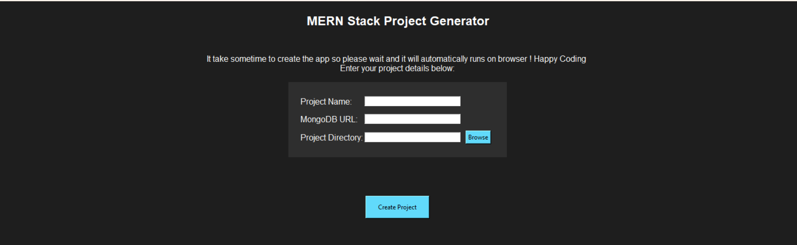

# MERN Stack Project Generator

 <!-- Replace with the actual path to your image -->

## Overview

The **MERN Stack Project Generator** is a powerful tool that automates the setup of a full-stack MERN (MongoDB, Express.js, React, Node.js) application. With a simple user interface built using Tkinter, this project allows developers to quickly create and run their MERN stack applications without the hassle of manual setup.

## Key Features

- **Easy Setup**: Create a new MERN stack project with just a few inputs.
- **React Frontend**: Automatically generates a React application using Create React App.
- **Express Backend**: Sets up an Express server with MongoDB integration.
- **Environment Configuration**: Automatically creates a `.env` file for sensitive configuration settings.
- **Live Servers**: Launch both the frontend and backend servers seamlessly.
- **User-Friendly UI**: Intuitive Tkinter interface for user inputs.
- **Customizable**: Easily extend and modify for additional features and functionality.

## Requirements

- **Python 3.x**: Ensure you have Python installed on your system.
- **Node.js**: Required for running the frontend and backend.
- **npm**: Comes with Node.js for package management.
- **MongoDB**: A MongoDB database for data storage (can be local or cloud-based).

## Installation

1. **Clone the repository**:
   ```bash
   git clone https://github.com/yourusername/mern-project-generator.git
   cd mern-project-generator

2. **Install required Python packages**:
    ```bash
    pip install -r requirements.txt

3. Install Node.js packages (this will be handled automatically by the project generator when creating a new project)

### Usage
## Run the application:

    ```bash
        Copy code
        python mern_project_generator.py
        Fill in the project details:

- Project Name: Name your new MERN project.
- MongoDB URL: Provide the connection string for your MongoDB database.
- Project Directory: Choose the directory where your project will be created.
- Click 'Create Project' to generate your new MERN stack application.